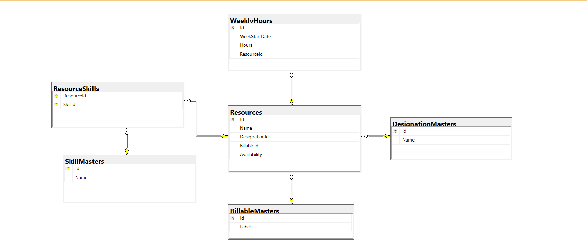

# 🥏 Team Slate (ASP.NET Core MVC)

A lightweight yet powerful web-based resource management tool that allows project managers to:

- Track and assign weekly working hours
- Manage skills and designations of resources
- View and edit resource availability in a dynamic grid interface

Think of it as your mini workforce planner— all built with clean architecture, modular controllers, and a SQL-backed relational database.

---

## 🚀 Features

- ✅ Full CRUD operations on Resources, Designations, Skills, Weekly Hours (allocated hours).
- 📅 Weekly allocation grid: Pick a date range and enter hours per resource
- 📊 Dynamic grid generation by week
- 🧠 Relational DB with support for:
  - Skills (multi-select per resource)
  - Designations
  - Billable status
- 💾 Data is persisted using EF Core and reflects immediately on reload

---

## 🧱 Tech Stack

| Layer          | Technology         |
|----------------|--------------------|
| Backend        | ASP.NET Core MVC |
| Frontend       | Razor Views + JS + Jquery/Select2 |
| ORM            | Entity Framework Core |
| Database       | SQL Server Express |  |

---

## 🗺️ Database Schema

Here's the underlying relational model:



### Tables:

#### `Resources`
- `Id`, `Name`, `DesignationId`, `BillableId`, `Availability`

#### `WeeklyHours`
- `Id`, `WeekStartDate`, `Hours`, `ResourceId (FK)`

#### `DesignationMasters`
- `Id`, `Name`

#### `BillableMasters`
- `Id`, `Label`

#### `SkillMasters`
- `Id`, `Name`

#### `ResourceSkills` (Many-to-Many)
- `ResourceId (FK)`, `SkillId (FK)`

> ⚡️ Migrations automatically seed initial Designation, Skill, and Billable master data + dummy resource entries for demo.

---

## 🛠️ Getting Started

### 📦 Prerequisites

- [Visual Studio 2022+](https://visualstudio.microsoft.com/) with ASP.NET and SQL workload
- [.NET 6.0 SDK+](https://dotnet.microsoft.com/en-us/download)
- SQL Server Express (LocalDB also works)

---

### 🧪 Run Locally

```bash
git clone https://github.com/TDJR007/TeamSlate.git
cd TeamSlate
```

### 1. Open the .sln file in Visual Studio

### 2. Modify appsettings.json:

```
"ConnectionStrings": {
  "DefaultConnection": "Server=localhost\\SQLEXPRESS;Database=ResourceAllocationDB;Trusted_Connection=True;"
}
```

>Replace localhost\\SQLEXPRESS with your local SQL instance name if needed.
To find it: Open SSMS → Connect → Copy Server Name
or run ```hostname``` command prompt.

### 3. Run Migrations in Package Manager Console:

**Tools-> NuGet Package Manager -> Package Manager Console** 

then run:

```
Update-Database
```

### 4. Hit F5 or click ▶️ Run with HTTPS/IIS Express
---

## ✨ UI Overview
- A homepage with CRUD access to Resource entries

- Dynamic grid shows hours per week between selected dates

- Dropdowns and multiselects to edit attributes like Designation, Skills, as well as editable fields for Resource Name and weekly hours.

---

## 🤝 Contributions

Feel free to fork, clone, and customize. If you break it, you fix it. If you make it better, tell me.

---

## 📜 Disclaimer

> This project is a simplified training assignment based on public concepts of resource allocation and scheduling.  
> It does **not** contain or replicate any proprietary code, architecture, or intellectual property belonging to any organization or employer.  
> The contents of this repository are intended **purely for educational and demonstration purposes.**

---

## 📜 License

MIT License 

---

